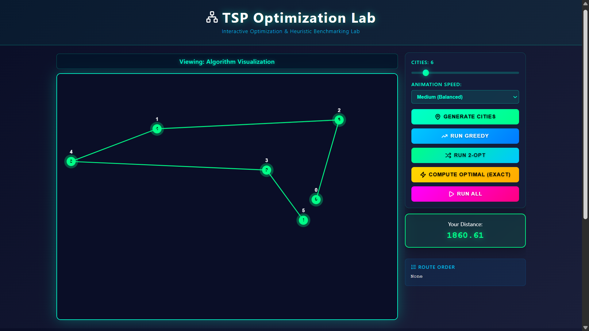
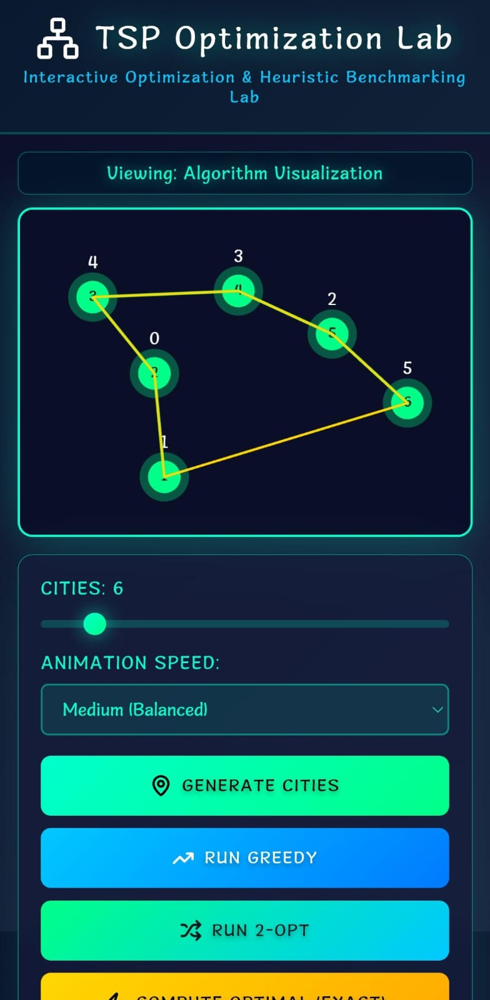
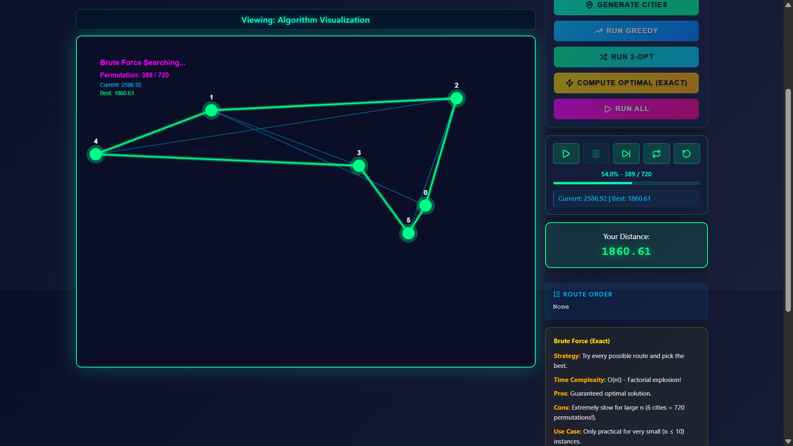

# TSP Arena – You vs Algorithm

Interactive algorithm visualization system for comparing user-defined routes against heuristic and optimal solutions to the Traveling Salesman Problem.

**Live Demo**: [https://tsp-optimization-lab.netlify.app/](https://tsp-optimization-lab.netlify.app/)

---

## Screenshots

Representative interface states across desktop and mobile environments.

<p align="center">
  
  
</p>
<p align="center">
  
</p>

---

## Overview

This application provides a step-controlled visualization environment for the Traveling Salesman Problem (TSP), an NP-hard optimization problem requiring the shortest route visiting all cities exactly once. The system implements multiple solution approaches with correctness guarantees and performance constraints.

The platform enables direct comparison of user-constructed routes, greedy nearest-neighbor heuristic, 2-opt local search optimization, and brute-force exhaustive enumeration.

The implementation emphasizes algorithm correctness through EPSILON-based floating-point comparison, invariant validation, and centralized distance calculation for consistency across all algorithms.

---

## Core Features

### Interactive Visualization
- Canvas-based city placement with configurable problem size (3-30 cities)
- Click-to-build manual route construction
- Real-time rendering with distinct colors per algorithm
- Responsive canvas scaling with device pixel ratio support

### Algorithm Execution Controls
- Step-by-step playback with play, pause, next, and replay controls
- Adjustable animation speed (slow, medium, fast)
- Real-time brute-force search with async cancellation support
- Progress tracking with permutation count and percentage completion

### Dynamic Comparison System
- Gap vs optimal calculation showing percentage deviation
- Match indicators (✓) when heuristic achieves optimal solution
- Best distance highlighting across all computed routes
- Iteration tracking per algorithm
- Wall-clock execution time measurement

### Engineering Safeguards
- EPSILON tolerance (10^-9) for floating-point comparison
- Invariant validation detecting heuristic < optimal violations
- Mobile performance guard disabling brute-force for n > 20 on mobile devices
- City limit enforcement for optimal algorithm (n ≤ 9)
- Resize debouncing (150ms) to prevent excessive redraw

### Responsive Design
- Mobile-first CSS with progressive enhancement
- Touch event handling with double-tap prevention
- Viewport-aware canvas sizing
- Data-label card layout for mobile table display

---

## Algorithm Implementations

### Greedy TSP (Nearest Neighbor)

**Approach**: Starting from city 0, iteratively select the closest unvisited city until all cities have been visited, then return to the origin.

**Time Complexity**: O(n²) - For each of n cities, scan remaining unvisited cities to find minimum distance.

**Iteration Metric**: Number of city selections (edges added to route)

**Characteristics**:
- Polynomial-time approximation with no optimality guarantee
- Fast execution even for large problem instances
- Solution quality varies based on city distribution

---

### 2-Opt Local Search

**Approach**: Begin with an initial tour (typically from greedy). Iteratively examine all pairs of edges. If reversing the segment between two edges reduces total distance, perform the swap. Continue until no improving swap exists.

**Time Complexity**: O(n²) per iteration, typically converges in O(n) iterations

**Iteration Metric**: Number of successful edge swaps that reduced tour distance

**Characteristics**:
- Iterative improvement heuristic converging to local optimum
- Solution quality depends on initial tour
- Significantly improves greedy solutions in practice

**Implementation Note**: Uses first-improvement strategy, accepting the first swap that reduces distance.

---

### Brute Force (Optimal)

**Approach**: Generate all possible permutations of cities, compute the closed tour distance for each, and return the permutation with minimum distance. Guarantees finding the globally optimal solution through exhaustive enumeration.

**Time Complexity**: O(n!) - For n cities, there are (n-1)!/2 distinct tours (accounting for circular symmetry and bidirectional equivalence). System does not implement symmetry reduction, evaluating more permutations for implementation clarity.

**Iteration Metric**: Total number of permutations evaluated

**Constraints**:
- Limited to n ≤ 9 cities on desktop (181,440 permutations for n=9)
- Limited to n ≤ 20 on mobile devices (performance guard)
- Real-time async execution with cancellation support

**Visualization**: Real-time canvas updates showing current best route as search progresses.

---

## Validation and Correctness Guarantees

### EPSILON-Based Floating Point Comparison

Distance calculations use floating-point arithmetic, which introduces numerical precision issues. The system defines `EPSILON = 1e-9` for all comparisons:

```javascript
if (Math.abs(distance1 - distance2) < EPSILON) {
  // Treat as equal
}
```

This ensures robust equality testing when determining if a heuristic solution matches the optimal solution.

### Invariant Validation

The system enforces the mathematical property: `distance(heuristic) ≥ distance(optimal)`

If any heuristic algorithm produces a distance strictly less than the brute-force optimal distance (beyond EPSILON tolerance), this indicates a software defect. Console warnings log such violations:

```javascript
if (greedyDistance < optimalDistance - EPSILON) {
  console.warn("Invariant violation: Greedy beats optimal");
}
```

### Centralized Distance Calculation

The `calculateTotalDistance()` function in `algorithms/tsp-solver.js` serves as the single source of truth for distance computation. All algorithms use this function to ensure consistency. The function handles route closure (returning to starting city) uniformly.

---

## Architecture

### Modular Structure

```
src/
├── script.js                       # Main orchestration and state management
├── algorithms/
│   └── tsp-solver.js               # Pure algorithm implementations
└── modules/
    ├── animation-engine.js         # Canvas rendering and drawing
    ├── stepController.js           # Playback control and state
    ├── stepRenderer.js             # Deterministic step rendering
    ├── ui-manager.js               # DOM manipulation and table updates
    ├── greedyStepGenerator.js      # Greedy execution trace generation
    ├── twoOptStepGenerator.js      # 2-opt execution trace generation
    ├── bruteForceRealtime.js       # Async optimal search with cancellation
    └── bruteForceStepGenerator.js  # Brute-force result visualization
```

### Component Responsibilities

**AnimationEngine**: Manages canvas drawing operations including city rendering, route visualization, and user selection feedback. Handles color mapping and glow effects.

**StepController**: Implements playback control (play, pause, next, replay, reset). Maintains current step index and manages animation timing. Provides UI state for button enable/disable logic.

**StepRenderer**: Renders algorithm execution states deterministically from step data. Separates algorithm logic from visualization concerns.

**UIManager**: Handles DOM queries, table updates, button state management, and user distance display. Encapsulates all direct DOM manipulation.

**Separation of Concerns**:
- Algorithm logic isolated in `algorithms/tsp-solver.js` (pure functions)
- Rendering separated from algorithm execution
- State management centralized in `script.js`
- UI interaction handled through dedicated manager

---

## Comparison Table Logic

### Dynamic Gap Computation

The "Gap vs Optimal" column is computed reactively whenever the comparison table renders:

```javascript
gap = ((algorithmDistance - optimalDistance) / optimalDistance) * 100
```

Gap values update automatically when:
- A heuristic algorithm completes and optimal is already available
- Optimal completes after heuristics have run
- Cities are regenerated (resets to "–")

### Match Indicators

The "Match" column displays:
- `✓` (green) if algorithm distance equals optimal within EPSILON tolerance
- `—` (gray) if algorithm distance exceeds optimal
- `✓ Optimal` (gold) for brute-force row (always optimal by definition)

### Best Distance Highlighting

The distance cell with the minimum value across all algorithms receives the `best-distance` CSS class, producing a green glow effect. This highlighting updates dynamically as algorithms complete.

### Iteration Counts

- **Greedy**: Number of edges added (city selections)
- **2-Opt**: Number of successful edge swaps
- **Brute Force**: Total permutations evaluated
- **User**: Displays "N/A" (manual construction)

---

## Performance Design Decisions

### Mobile Brute Force Guard

On devices with screen width ≤ 768px, brute-force is disabled when city count exceeds 20, preventing UI freezing on less powerful mobile hardware. Desktop systems restrict to n ≤ 9 based on factorial growth.

### Canvas Resize Debouncing

Window resize events are debounced with 150ms delay to prevent excessive canvas redraw. Implementation uses `clearTimeout()` to cancel pending redraws on rapid resize events.

### Device Pixel Ratio Scaling

Canvas buffer size is multiplied by `window.devicePixelRatio` to maintain sharp rendering on high-DPI displays. Logical CSS dimensions remain independent through `ctx.setTransform()`.

### City Placement Constraints

Minimum city distance of 60 pixels prevents overlapping and ensures visual clarity. Generation uses rejection sampling with maximum attempt limit to avoid infinite loops.

---

## Tech Stack

### Core Technologies
- **HTML5**: Semantic markup with Canvas API for rendering
- **CSS3**: Grid layout, flexbox, custom properties, glassmorphism effects
- **JavaScript ES6+**: Modules, async/await, generators, destructuring

### Design Rationale

No framework or library dependencies (except Lucide icons for UI elements). This decision was intentional:

- **Lightweight**: Zero bundle size, instant load times
- **Algorithm-Focused**: No abstraction layers obscuring algorithm implementation
- **Educational Clarity**: Direct DOM and Canvas API usage demonstrates web fundamentals
- **Deployment Simplicity**: Static files with no build process required

### Module System

ES6 modules enable code organization without bundler complexity:

```javascript
import { greedyTSP, twoOpt, bruteForceTSP, EPSILON } from './algorithms/tsp-solver.js';
import AnimationEngine from './modules/animation-engine.js';
```

Browser-native module loading eliminates tooling dependencies while maintaining modular architecture.

---

## How to Run Locally

### Prerequisites

Modern web browser with ES6 module support:
- Chrome 61+
- Firefox 60+
- Safari 11+
- Edge 16+

### Installation

```bash
git clone https://github.com/yuvalshahtech/tsp-arena.git
cd tsp-arena
npm install
```

### Development Server

```bash
npm start
```

This launches live-server on `http://localhost:8080` with automatic reload on file changes.

### Alternative: No Installation

Open `src/index.html` directly in your browser. No server required for basic functionality (ES6 modules work via `file://` protocol in most browsers).

### Alternative: Python HTTP Server

```bash
cd src
python -m http.server 8000
```

Navigate to `http://localhost:8000`

---

## Project Structure

```
tsp-arena/
├── src/
│   ├── index.html                      # Main application structure
│   ├── styles.css                      # Complete styling
│   ├── script.js                       # State management and orchestration
│   ├── algorithms/
│   │   └── tsp-solver.js               # Pure algorithm implementations
│   └── modules/
│       ├── animation-engine.js         # Canvas rendering
│       ├── ui-manager.js               # DOM manipulation
│       ├── stepController.js           # Playback control
│       ├── stepRenderer.js             # Step visualization
│       ├── greedyStepGenerator.js      # Greedy trace generation
│       ├── twoOptStepGenerator.js      # 2-opt trace generation
│       ├── bruteForceStepGenerator.js  # Brute-force visualization
│       ├── bruteForceRealtime.js       # Async optimal search
│       └── metrics-engine.js           # Performance tracking
├── netlify.toml                        # Deployment configuration
├── package.json                        # Project metadata
└── README.md                           # Documentation
```

---

## Deployment

Hosted on Netlify with continuous deployment from the main branch. The `netlify.toml` configuration specifies `src/` as the publish directory.

**Production URL**: [https://tsp-optimization-lab.netlify.app/](https://tsp-optimization-lab.netlify.app/)

No build step required. Deployment consists of copying static files to CDN.

---

## Future Enhancements

### Algorithm Implementations
- Christofides approximation with 1.5-approximation guarantee
- Symmetry reduction in brute-force to evaluate (n-1)!/2 permutations
- Held-Karp dynamic programming for improved exact solution

### Performance Optimization
- Web Worker offloading for brute-force computation
- Canvas rendering optimization with partial redraw

### Testing and Validation
- Unit test suite for algorithm correctness
- Benchmark mode with randomized test runs
- Statistical analysis of heuristic performance

### Export and Integration
- Export route results as JSON/CSV
- Import custom city configurations
- URL parameter support for shareable problem instances

### Code Quality
- Optional TypeScript migration for type safety
- JSDoc documentation coverage

---

## Author

**Yuval Shah**  
Mumbai, India

GitHub: [github.com/yuvalshahtech](https://github.com/yuvalshahtech)

---

## License

MIT License - Available for educational and portfolio use.

---
